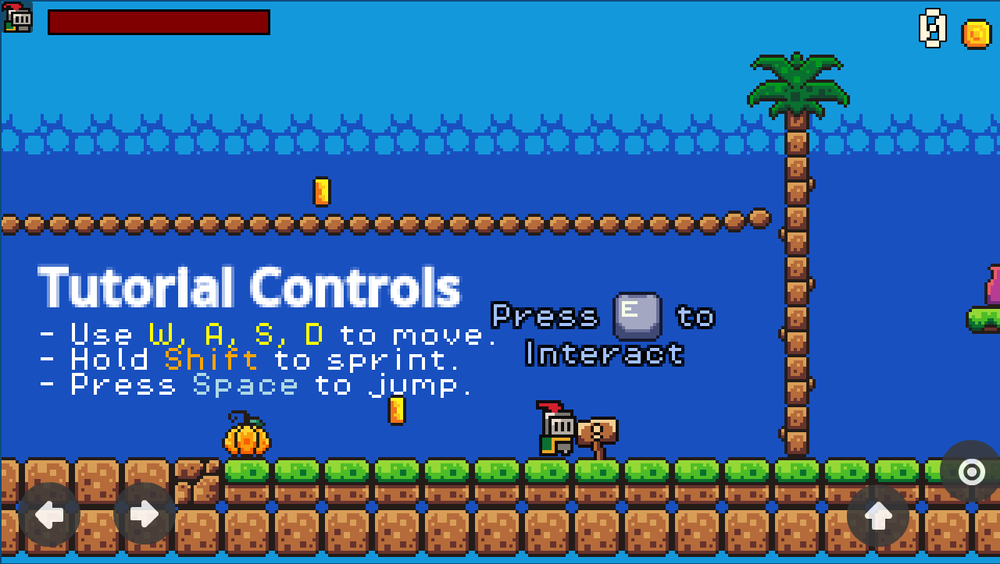

# Programming Warrior's

This project was made to learn [Godot](https://godotengine.org) and game features, it's a simple 2D platformer game.

## 📦 Supported Platforms

- 💻 **Desktop**
- 🎮 **Console**
- 📱 **Mobile**
- 🌐 **Web**

## Features

- [x] Smooth and responsive player movement
- [x] Coyote time and jump buffering
- [x] Player UI
- [x] Simple codebase
- [x] Pixel-perfect camera system
- [x] Gamepad, keyboard and mobile support
- [x] Pickups
- [x] Basic level design
- [x] Interactive objects
- [x] Simple Enemy
- [x] Translations English and Portuguese
- [x] Particles

---

Feel free to fork, clone, and expand it into your own platformer!
